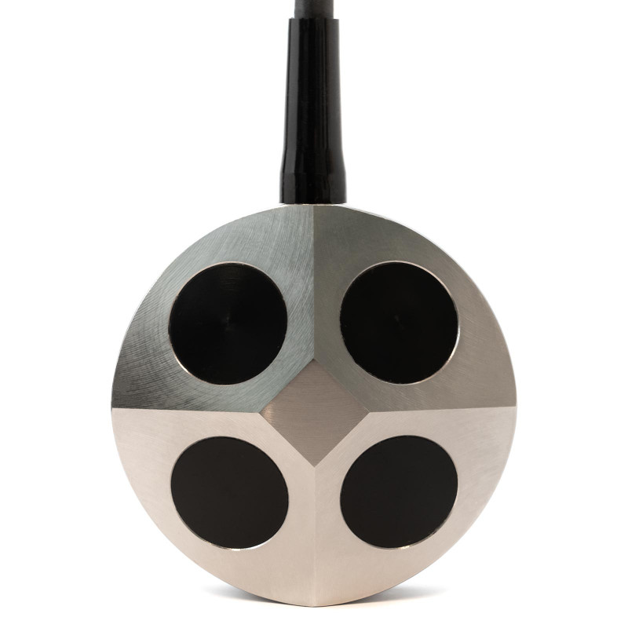
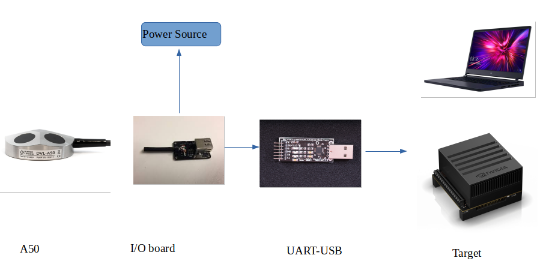

## Vortex A50-DVL driver <ROS2 C++ Package>

## Table of contents
* [Description](#Description)
* [Prerequisites](#Prerequisites)
* [Wiring](#Wiring)
* [Installation](#Installation)
* [Usage](#Usage)
* [Technical Details](#Technical-Details)

## Description
ROS2 package for serial-interfacing with waterlinked A50  DVL. 
There is also an associated custom-ros2-message for DVL measurement data.



## Prerequisites
* Linux distributions Bionic (Ubuntu 18.04)
* C++ 11 compiler or newer.
* ROS2 - Eloquent 

## Wiring


## Installation
Inside the src folder of your ROS2 workspace, clone the package 

```
$ cd ~/vortex_ws/src
$ git clone git clone https://github.com/MoMagDii/dvl_ROS2driver.git
```


